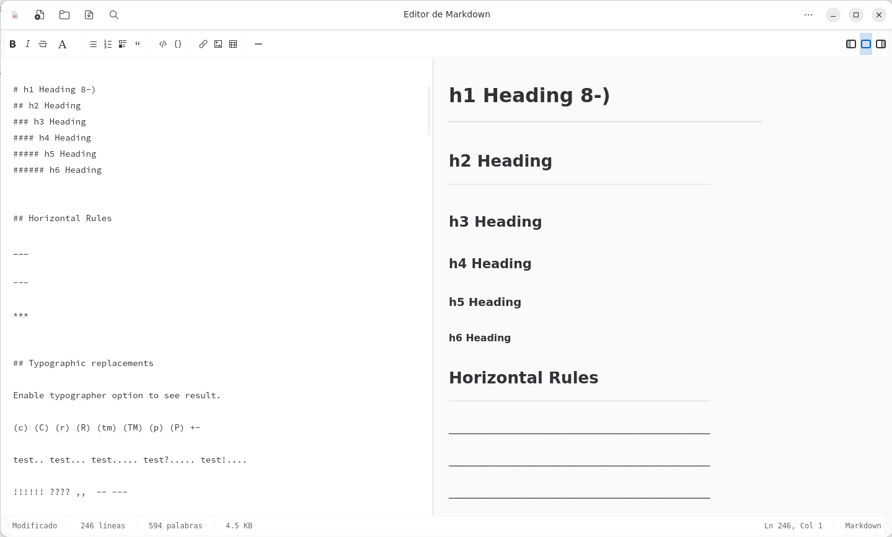

# Markdown Editor

A simple and powerful Markdown editor with real-time preview, built with GTK4 and Adwaita.



## Features

- **Real-time preview** with scroll synchronization
- **Multiple rendering styles** (GitHub, GitLab, Splendor, Air, etc.)
- **Modern interface** using GTK4 and Adwaita
- **Multi-language support** (Spanish, English)
- **Document search** with highlighting
- **Complete toolbar** for Markdown formatting
- **Keyboard shortcuts** for common actions
- **Adaptive view** (editor only, preview only, split view)
- **Light/dark theme**

## Installation

### From Flatpak (Recommended)

```bash
# Install from Flathub (coming soon)
flatpak install flathub com.pabmartine.MarkdownEditor

# Or build locally
flatpak-builder build-dir com.pabmartine.MarkdownEditor.yml --install --user
```

### From source code

#### Dependencies

**Ubuntu/Debian:**
```bash
sudo apt install python3-gi python3-gi-cairo gir1.2-gtk-4.0 gir1.2-adw-1
sudo apt install python3-markdown  # Optional, for advanced rendering
```

**Fedora:**
```bash
sudo dnf install python3-gobject gtk4-devel libadwaita-devel
sudo dnf install python3-markdown  # Optional
```

**Arch Linux:**
```bash
sudo pacman -S python-gobject gtk4 libadwaita
sudo pacman -S python-markdown  # Optional
```

#### Installation

```bash
# Clone the repository
git clone https://gitlab.com/pabmartine/markdown-editor.git
cd markdown-editor

# Install desktop file (optional)
python3 markdown-editor.py --install-desktop

# Run
python3 markdown-editor.py
```

## Usage

### Keyboard shortcuts

| Shortcut | Action |
|----------|--------|
| `Ctrl+N` | New document |
| `Ctrl+O` | Open file |
| `Ctrl+S` | Save file |
| `Ctrl+F` | Search in document |
| `Ctrl+B` | **Bold** text |
| `Ctrl+I` | *Italic* text |
| `Ctrl+K` | Insert link |
| `Ctrl+P` | Print |
| `Esc` | Close search |

### Toolbar

The toolbar includes buttons for:

- **Text formatting**: Bold, italic, strikethrough
- **Headers**: H1 to H6
- **Lists**: Bulleted, numbered, tasks
- **Elements**: Quotes, code, tables, horizontal lines
- **Media**: Links, images

### Rendering styles

The editor includes several rendering styles:

- **Default**: Clean standard style
- **GitHub**: Mimics GitHub's style
- **GitHub Light/Dark**: Light and dark variants
- **GitLab**: GitLab style
- **Splendor**: Elegant and modern design
- **Modest**: Minimalist style
- **Retro**: Vintage appearance
- **Air**: Spacious and clean design

## Configuration

Configuration is automatically saved in:
- `~/.config/markdown-editor/config.json`

Includes:
- Window position and size
- Interface language
- Theme (light/dark)
- Rendering style

## Development

### Project structure

```
markdown-editor/
├── markdown-editor.py          # Main application
├── locale/                     # Translation files
│   ├── es/LC_MESSAGES/
│   └── en/LC_MESSAGES/
├── com.pabmartine.MarkdownEditor.yml  # Flatpak manifest
├── com.pabmartine.MarkdownEditor.desktop
└── README.md
```

### Running in development mode

```bash
# Run with debug
python3 markdown-editor.py --debug

# Run tests
python3 markdown-editor.py --test

# View system information
python3 markdown-editor.py --debug
```

### Building Flatpak

```bash
# Install build dependencies
sudo apt install flatpak-builder

# Build
flatpak-builder build-dir com.pabmartine.MarkdownEditor.yml --force-clean

# Install locally
flatpak-builder build-dir com.pabmartine.MarkdownEditor.yml --install --user
```

### Internationalization

To add new languages:

1. Create language directory: `locale/[code]/LC_MESSAGES/`
2. Generate `.pot` file: 
   ```bash
   xgettext --keyword=_ --language=Python --output=locale/markdown-editor.pot markdown-editor.py
   ```
3. Create translation:
   ```bash
   msginit --locale=[code] --input=locale/markdown-editor.pot --output=locale/[code]/LC_MESSAGES/markdown-editor.po
   ```
4. Compile translation:
   ```bash
   msgfmt locale/[code]/LC_MESSAGES/markdown-editor.po -o locale/[code]/LC_MESSAGES/markdown-editor.mo
   ```
5. Update language list in code

## Contributing

Contributions are welcome. Please:

1. Fork the project
2. Create a feature branch: `git checkout -b feature/new-feature`
3. Commit your changes: `git commit -am 'Add new feature'`
4. Push to the branch: `git push origin feature/new-feature`
5. Submit a Pull Request

### Reporting issues

If you find a bug or have a suggestion:

1. Search in [existing Issues](https://gitlab.com/pabmartine/markdown-editor/-/issues)
2. If it doesn't exist, create a new Issue with:
   - Clear description of the problem
   - Steps to reproduce
   - System information
   - Logs if possible

## License

This project is licensed under GPL v3. See [LICENSE](LICENSE) for details.

---

**Like the project?** ⭐ Give it a star on GitLab