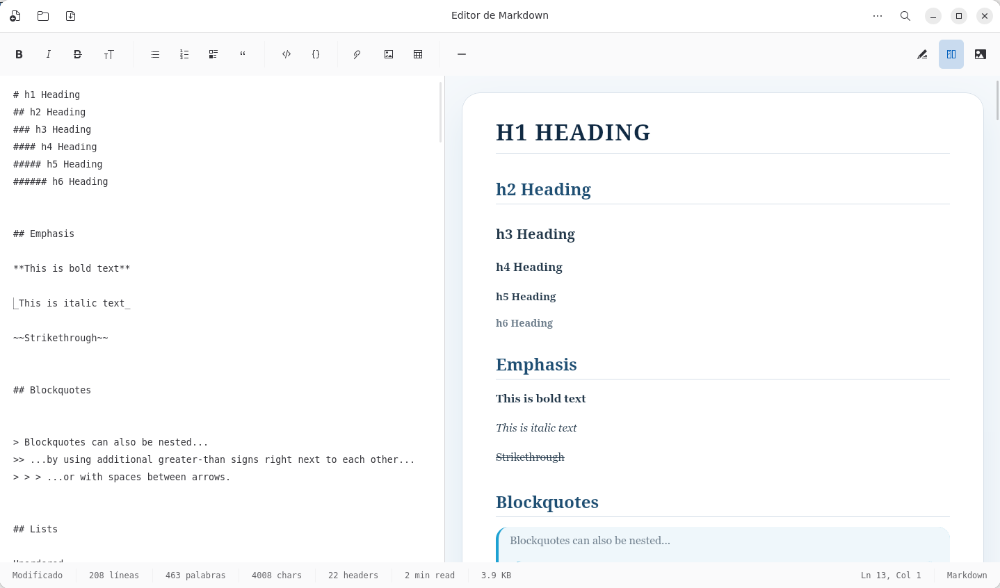

# Markdown Editor

A GTK4/libadwaita Markdown editor with embedded HTML preview, split editing and a native GNOME-style interface.



## Features

- **Embedded HTML preview** rendered with WebKitGTK and synchronized with the editor
- **Distinct preview styles** (`Default`, `Slate`, `Ivory`, `Nocturne`, `Ember`, `Splendor`, `Modest`, `Retro`, `Air`)
- **Modern interface** using GTK4 and Adwaita
- **Multi-language support** (Spanish, English)
- **Search and replace**
- **Complete toolbar** for Markdown formatting
- **Keyboard shortcuts** for common actions
- **Adaptive view** (editor only, preview only, split view)
- **Outline panel** for heading navigation
- **Open recent**, drag and drop, and session recovery
- **HTML/PDF export and printing** based on the rendered preview
- **Light/dark theme**

## Installation

### From Flatpak (Recommended)

```bash
# Install from Flathub (coming soon)
flatpak install flathub com.pabmartine.MarkdownEditor

# Or build locally
flatpak-builder build-dir com.pabmartine.MarkdownEditor.yml --install --user
```

### From source code

#### Required dependencies

The application needs all of the following for a normal desktop run:

- Python 3
- PyGObject bindings for GTK4
- GTK 4
- libadwaita
- WebKitGTK for GTK4
- `markdown-it-py`

Without `WebKitGTK`, the embedded preview cannot render.
Without `markdown-it-py`, Markdown rendering falls back to a reduced path.

#### Install required dependencies

**Ubuntu/Debian:**
```bash
sudo apt install python3-gi python3-gi-cairo gir1.2-gtk-4.0 gir1.2-adw-1 gir1.2-webkit-6.0
python3 -m pip install markdown-it-py
```

**Fedora:**
```bash
sudo dnf install python3-gobject gtk4-devel libadwaita-devel webkitgtk6.0-devel
python3 -m pip install markdown-it-py
```

**Arch Linux:**
```bash
sudo pacman -S python-gobject gtk4 libadwaita webkitgtk-6.0
python3 -m pip install markdown-it-py
```

#### Optional dependencies

- `pygments`: optional, useful if you want the legacy non-HTML renderer paths and developer checks to have richer syntax highlighting
- `python-markdown`: optional fallback parser if `markdown-it-py` is unavailable, but not the preferred path

#### Installation

```bash
# Clone the repository
git clone https://github.com/pabmartine/markdown-editor.git
cd markdown-editor

# Install desktop file (optional)
python3 markdown-editor.py --install-desktop

# Run
python3 markdown-editor.py
```

## Usage

### Keyboard shortcuts

| Shortcut | Action |
|----------|--------|
| `Ctrl+N` | New document |
| `Ctrl+O` | Open file |
| `Ctrl+S` | Save file |
| `Ctrl+F` | Search in document |
| `Ctrl+B` | **Bold** text |
| `Ctrl+I` | *Italic* text |
| `Ctrl+K` | Insert link |
| `Ctrl+P` | Print |
| `Esc` | Close search |

### Editor behavior

- Pressing `Enter` inside bullet, numbered or task lists continues the list automatically.
- Opening search with selected text pre-fills the search query.
- The outline can be opened on demand and clicking an entry jumps to that section.
- Images can be inserted from a file chooser or by drag and drop.
- Preferences open in their own movable window instead of a fixed modal panel.

### Toolbar

- **Text formatting**: Bold, italic, strikethrough
- **Headers**: H1 to H6
- **Lists**: Bulleted, numbered, tasks
- **Elements**: Quotes, code, tables, horizontal lines
- **Media**: Links, images

### Preview styles

The editor includes several rendering styles for the embedded HTML preview:

- **Default**: Clean documentation-like layout
- **Slate**: Cool editorial style with muted blue-gray structure
- **Ivory**: Book-like serif presentation with warm paper tones
- **Nocturne**: High-contrast dark style for night reading
- **Ember**: Warm magazine-inspired layout with terracotta accents
- **Splendor**: Elegant display typography with more ceremonial headings
- **Modest**: Flat, restrained and practical reading style
- **Retro**: Vintage typewriter-inspired paper aesthetic
- **Air**: Bright, spacious and lightweight reading experience

### Export and print

- **Export as HTML** writes the same themed HTML representation used by the preview.
- **Export as PDF** and **Print** use the rendered HTML preview instead of raw Markdown text.
- PDF output uses a compact print stylesheet so page density is higher than the on-screen preview.

## Configuration

Configuration is automatically saved in:
- `~/.config/markdown-editor/config.json`

Includes:
- Window position and size
- Interface language
- Theme (light/dark)
- Preview style
- Recent files
- Recovery/session preferences
- Editor font size and content width

## Development

### Project structure

```
markdown-editor/
├── markdown-editor.py
├── src/markdown_editor/
│   ├── core/
│   ├── models/
│   ├── repositories/
│   ├── services/
│   ├── ui/
│   ├── app.py
│   └── main.py
├── tests/
├── docs/
├── data/
└── packaging/flatpak/
```

### Running in development mode

```bash
# Run tests
python3 markdown-editor.py --test

# Run normally
python3 markdown-editor.py
```

### Building Flatpak

```bash
# Install build dependencies
sudo apt install flatpak-builder

# Build
flatpak-builder build-dir com.pabmartine.MarkdownEditor.yml --force-clean

# Install locally
flatpak-builder build-dir com.pabmartine.MarkdownEditor.yml --install --user
```

### Internationalization

To add new languages:

1. Create language directory: `locale/[code]/LC_MESSAGES/`
2. Generate `.pot` file: 
   ```bash
   xgettext --keyword=_ --language=Python --output=locale/markdown-editor.pot markdown-editor.py
   ```
3. Create translation:
   ```bash
   msginit --locale=[code] --input=locale/markdown-editor.pot --output=locale/[code]/LC_MESSAGES/markdown-editor.po
   ```
4. Compile translation:
   ```bash
   msgfmt locale/[code]/LC_MESSAGES/markdown-editor.po -o locale/[code]/LC_MESSAGES/markdown-editor.mo
   ```
5. Update language list in code

## Contributing

Contributions are welcome. Please:

1. Fork the project
2. Create a feature branch: `git checkout -b feature/new-feature`
3. Commit your changes: `git commit -am 'Add new feature'`
4. Push to the branch: `git push origin feature/new-feature`
5. Submit a Pull Request

### Reporting issues

If you find a bug or have a suggestion:

1. Search in [existing Issues](https://github.com/pabmartine/markdown-editor/issues)
2. If it doesn't exist, create a new Issue with:
   - Clear description of the problem
   - Steps to reproduce
   - System information
   - Logs if possible

## License

This project is licensed under GPL v3. See [LICENSE](LICENSE) for details.

---

**Like the project?** Give it a star on GitHub.
